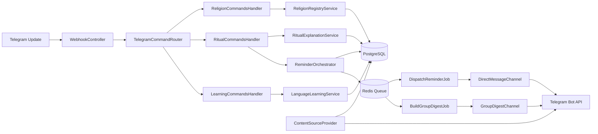

## Implementation Prompt: Multi-Religion Rebe Bot Platform (Laravel)

Build this as a derivative architecture of `R2Rprogpower/craftChronicles`.
Reuse its module conventions, API route loading pattern, authentication stack, and security posture as the base. Then add Telegram bot capabilities and domain modules for religion/confession, rituals, reminders, content, and multi-language learning.

Baseline inheritance from craftChronicles:

1. Laravel 12 application shape and bootstrapping style.
2. Module layout under `app/Modules/*` with module-local `api.php` route files.
3. Auth model: Sanctum personal access tokens with optional MFA verification.
4. Authorization model: Spatie permissions/roles tables and checks.
5. Layering style per module: DTO + Requests + Processors + Services + Repositories + Presentations + Resources.
6. Documentation structure under `docs/` with indexed, focused operational guides.

## Product Scope

1. Multi-religion in one shared Telegram group.
2. Per-user religion preference scoped to each group membership.
3. Rituals are optional per religion/confession and per user.
4. Ritual explanation on demand when a ritual model is enabled.
5. Ritual reminders with DM-first policy and optional digest in group.
6. Weekly chapter text + analysis feed by religion/content pack.
7. Language teaching module as independent utility package (not Hebrew-only).
8. Open custom religions/confessions via command, with policy controls.
9. Fully custom language packs per religion/confession (examples: Old Russian, Russian, Arabic, Latin).
10. Admin CRUD for religions, confessions, rituals, language packs, content items, schedules, and policy settings.

## Architecture Composition

## Documentation Reuse Strategy (from craftChronicles)

Reuse the documentation skeleton from craftChronicles and adapt each file to this bot platform. Do not start docs from zero.

Adopt this exact docs index pattern:

1. `docs/01-local-setup.md`
2. `docs/02-api-overview.md`
3. `docs/03-module-database.md`
4. `docs/04-openapi.md`
5. `docs/05-production-deploy.md`
6. `docs/06-rollback-and-backups.md`
7. `docs/07-security-and-troubleshooting.md`
8. `docs/08-template-repo-workflow.md`

Required adaptation for each document:

1. Replace domain examples with Telegram bot modules (`Telegram`, `Religions`, `Rituals`, `Reminders`, `Languages`, `Learning`, `Admin`).
2. Keep operational format and command style consistent with craftChronicles docs.
3. Preserve security sections for Sanctum, MFA, DB exposure, and admin access hardening.
4. Preserve deployment runbooks (blue-green, rollback, backup), updated for this project's service names.
5. Add language-pack and content-attribution runbooks under the relevant docs.
6. Keep README as docs index entrypoint, mirroring craftChronicles style.

Minimum docs deliverables for first implementation PR:

1. `README.md` with docs index and quick start.
2. `docs/01-local-setup.md` with Docker-based setup and migration/seed steps.
3. `docs/02-api-overview.md` listing auth routes, admin CRUD routes, and Telegram webhook endpoints.
4. `docs/03-module-database.md` documenting module-local migration strategy and core tables.
5. `docs/07-security-and-troubleshooting.md` documenting MFA requirements for privileged admin operations.

### craftChronicles Compatibility Requirements

1. Keep top-level route registration pattern: central `routes/api.php` requiring module `api.php` files.
2. Keep module packaging style: `app/Modules/<ModuleName>/...`.
3. Keep standardized success/error response format compatible with existing `SuccessResponse` pattern.
4. Keep auth middleware style (`auth:sanctum`) for protected CRUD endpoints.
5. Keep audit logging hooks for security-sensitive operations.
6. Keep migrations compatible with PostgreSQL and existing deployment posture.
7. Keep docs format and operational documentation depth aligned with craftChronicles docs set.

### Bounded Contexts

1. Platform.Telegram: webhook ingestion, command parsing, Telegram API delivery.
2. Domain.Identity: users, chats, memberships, preferences, consent.
3. Domain.Religion: religion registry, moderation state, metadata.
4. Domain.Ritual: ritual definitions, rules, explanations, next-occurrence calculation.
5. Domain.Reminder: reminder planner, due-item resolver, delivery orchestration.
6. Domain.Content: chapter retrieval, source attribution, licensing policy.
7. Domain.Learning: multi-language drills, transliteration, script conversion, spaced repetition state.
8. Domain.Admin: CRUD orchestration, moderation workflow, and policy enforcement.
9. Utilities: parsers, formatters, date helpers, transliteration.

### Module Composition (Reuse craftChronicles Pattern)

Implement these as modules, each with the same internal structure style used in the base project.

1. `app/Modules/Auth` (reuse/adapt existing)
2. `app/Modules/Permissions` (reuse/adapt existing)
3. `app/Modules/Users` (reuse/adapt existing)
4. `app/Modules/Telegram` (webhook + Telegram delivery)
5. `app/Modules/Religions` (religion/confession registry)
6. `app/Modules/Rituals` (optional ritual definitions + explainers)
7. `app/Modules/Reminders` (planner, due resolver, dispatch)
8. `app/Modules/Content` (weekly chapter + analysis)
9. `app/Modules/Languages` (language packs + transliteration)
10. `app/Modules/Learning` (drills and progress)
11. `app/Modules/Admin` (cross-entity CRUD orchestration)

For each new module, follow this shape where relevant:

1. `DTO/`
2. `Database/Migrations/`
3. `Http/Controllers/`
4. `Http/Requests/`
5. `Presentations/`
6. `Processors/`
7. `Repositories/`
8. `Services/`
9. `Resources/` (if API resources are needed)
10. `api.php`

### Runtime Flow

1. Telegram webhook receives update.
2. `TelegramCommandRouter` resolves command and context.
3. Handler issues application command (set religion, explain ritual, schedule reminders, etc.).
4. Domain services mutate state using repositories.
5. Outbound messages are queued and sent by channel adapters.
6. Scheduler ticks planner jobs for reminders and weekly content.

### Composition Diagram



## Interface Contracts (Define First)

Create these contracts before any implementation classes.

```php
<?php

interface ReligionProviderInterface
{
	public function listReligionsForGroup(int $groupId): array;
	public function createCustomReligion(int $groupId, int $createdByUserId, array $payload): ReligionDTO;
	public function approveReligion(int $groupId, int $religionId, int $adminUserId): void;
	public function findBySlug(int $groupId, string $slug): ?ReligionDTO;
}

interface RitualScheduleProviderInterface
{
	public function getRitualDefinitions(int $religionId): array;
	public function nextOccurrences(int $ritualId, string $timezone, \DateTimeImmutable $from, int $limit = 5): array;
	public function isDue(int $ritualId, \DateTimeImmutable $at, string $timezone): bool;
}

interface ContentSourceInterface
{
	public function fetchWeeklyChapter(int $religionId, \DateTimeImmutable $weekOf, string $locale = 'en'): ChapterDTO;
	public function fetchAnalysis(int $religionId, string $chapterKey, string $locale = 'en'): AnalysisDTO;
	public function sourceMetadata(string $chapterKey): SourceAttributionDTO;
}

interface ReminderChannelInterface
{
	public function channelName(): string;
	public function send(ReminderMessageDTO $message): DeliveryResultDTO;
	public function canDeliver(UserContextDTO $userContext): bool;
}

interface PreferenceRepositoryInterface
{
	public function setUserReligionInGroup(int $userId, int $groupId, int $religionId): void;
	public function getUserReligionInGroup(int $userId, int $groupId): ?int;
	public function getReminderPreferences(int $userId, int $groupId): ReminderPreferenceDTO;
  public function setRitualMode(int $userId, int $groupId, string $mode): void;
}

interface LanguagePackProviderInterface
{
  public function listForReligion(int $religionId): array;
  public function createCustomPack(int $religionId, int $createdByUserId, array $payload): LanguagePackDTO;
  public function resolvePack(int $religionId, string $languageCode): ?LanguagePackDTO;
}

interface TransliterationStrategyInterface
{
  public function supports(string $fromScript, string $toScript): bool;
  public function transliterate(string $text, string $fromScript, string $toScript): string;
}

interface AdminCrudServiceInterface
{
  public function createEntity(string $entityType, array $payload, AdminContextDTO $admin): EntityDTO;
  public function updateEntity(string $entityType, int $entityId, array $payload, AdminContextDTO $admin): EntityDTO;
  public function deleteEntity(string $entityType, int $entityId, AdminContextDTO $admin): void;
  public function listEntities(string $entityType, array $filters, AdminContextDTO $admin): array;
}

interface AuthorizationPolicyInterface
{
  public function canCreate(string $entityType, AdminContextDTO $admin): bool;
  public function canUpdate(string $entityType, int $entityId, AdminContextDTO $admin): bool;
  public function canDelete(string $entityType, int $entityId, AdminContextDTO $admin): bool;
}

interface MfaVerificationGateInterface
{
  public function requireRecentMfa(AdminContextDTO $admin, string $operation): void;
}
```

## Core Services and Responsibilities

1. `ReligionRegistryService`
2. Validates creation payload for custom religion.
3. Applies policy: open, approval required, admin-only.
4. Emits audit event when religion is created/approved/rejected.

1. `RitualExplanationService`
2. Checks whether ritual mode is enabled for religion and user.
2. Resolves user religion by membership context.
3. Loads ritual definition and explanation template.
4. Renders explanation with source attribution and locale.

1. `ReminderOrchestrator`
2. Skips ritual generation when ritual mode is disabled.
2. Computes due reminders from ritual schedule + user preferences.
3. Writes `reminder_instances` idempotency record.
4. Dispatches channel-specific jobs (DM always, digest optional).

1. `WeeklyChapterComposer`
2. Fetches chapter text + analysis through `ContentSourceInterface`.
3. Composes a message block based on religion and locale.
4. Appends attribution and licensing notices.

1. `LanguageLearningService` (generic utility)
2. Generates daily word/card from chapter context for selected language pack.
3. Stores drill history and spaced repetition score.
4. Supports transliteration and script-conversion strategies via pluggable utilities.
5. Resolves language by user preference in group, with fallback to religion default.

1. `AdminCrudService`
2. Exposes validated CRUD operations for all managed entities.
3. Applies authorization policy and moderation checks.
4. Emits audit events for all create/update/delete actions.
5. Requires MFA re-verification for high-risk operations (delete/bulk update/policy changes).

## Database Design

Use PostgreSQL 16+ and Redis for queues/cache.

### Tables

1. `users`
2. `id`, `telegram_user_id` (unique), `username`, `display_name`, `locale`, `timezone`, `created_at`, `updated_at`.

1. `chats`
2. `id`, `telegram_chat_id` (unique), `type` (group/supergroup/private), `title`, `settings_json`, timestamps.

1. `chat_memberships`
2. `id`, `chat_id`, `user_id`, `role` (owner/admin/member), `is_active`, `joined_at`, `left_at`.
3. Unique index: `(chat_id, user_id)`.

Reuse existing Spatie RBAC schema from base project migration set:

1. `roles`
2. `permissions`
3. `model_has_roles`
4. `model_has_permissions`
5. `role_has_permissions`

Do not create duplicate custom RBAC tables unless there is a migration-backed, documented reason.

1. `religions`
2. `id`, `chat_id` (nullable for global), `slug`, `name`, `description`, `status` (active/pending/rejected), `ritual_mode` (none/optional/required), `is_custom`, `created_by_user_id`, `metadata_json`, timestamps.
3. Unique index: `(chat_id, slug)` for chat-scoped custom entries.

1. `user_group_preferences`
2. `id`, `user_id`, `chat_id`, `religion_id`, `language_pack_id` (nullable), `ritual_opt_in`, `dm_opt_in`, `digest_opt_in`, `quiet_hours_json`, `timezone_override`, timestamps.
3. Unique index: `(user_id, chat_id)`.

1. `language_packs`
2. `id`, `religion_id`, `code`, `display_name`, `script`, `is_custom`, `status` (active/pending/rejected), `created_by_user_id`, `metadata_json`, timestamps.
3. Unique index: `(religion_id, code)`.

1. `rituals`
2. `id`, `religion_id`, `key`, `name`, `description`, `cadence_type` (cron/calendar/event), `cadence_expr`, `lead_minutes`, `metadata_json`, `is_active`, timestamps.
3. Unique index: `(religion_id, key)`.

1. `ritual_explanations`
2. `id`, `ritual_id`, `locale`, `format` (markdown/plain), `template_text`, `source_url`, `source_title`, timestamps.
3. Unique index: `(ritual_id, locale)`.

1. `reminder_instances`
2. `id`, `ritual_id`, `user_id`, `chat_id`, `scheduled_for_utc`, `status` (planned/sent/failed/skipped), `idempotency_key`, `attempt_count`, `last_error`, timestamps.
3. Unique index: `idempotency_key`.
4. Composite index: `(scheduled_for_utc, status)`.

1. `digest_batches`
2. `id`, `chat_id`, `window_start_utc`, `window_end_utc`, `payload_json`, `status`, timestamps.
3. Unique index: `(chat_id, window_start_utc, window_end_utc)`.

1. `content_items`
2. `id`, `religion_id`, `item_type` (chapter/analysis/lesson), `external_key`, `title`, `body_text`, `locale`, `version`, `license_json`, `source_url`, `published_for_date`, timestamps.
3. Unique index: `(religion_id, item_type, external_key, locale, version)`.

1. `learning_cards`
2. `id`, `religion_id`, `language_pack_id`, `locale`, `term`, `script_text`, `transliteration`, `meaning`, `example_text`, `source_content_item_id`, `metadata_json`, timestamps.

1. `learning_progress`
2. `id`, `user_id`, `card_id`, `score`, `next_review_at_utc`, `streak`, `last_result`, timestamps.
3. Unique index: `(user_id, card_id)`.

1. `source_attributions`
2. `id`, `content_item_id`, `provider`, `license_name`, `license_url`, `required_notice`, `cached_until`, timestamps.

1. `audit_events`
2. `id`, `actor_user_id`, `chat_id`, `event_type`, `entity_type`, `entity_id`, `before_json`, `after_json`, `ip_hash`, timestamps.

1. `entity_revisions`
2. `id`, `entity_type`, `entity_id`, `revision_no`, `change_type` (create/update/delete), `changed_by_user_id`, `delta_json`, `created_at`.
3. Unique index: `(entity_type, entity_id, revision_no)`.

### DB Rules

1. Use foreign keys with `ON DELETE CASCADE` on dependent preference/reminder records.
2. Store UTC in DB, convert on render with user/group timezone.
3. Use JSONB for extensible religion-specific metadata.
4. Keep immutable audit rows for policy-sensitive actions.
5. Model language as first-class: every learning/content record stores `language_pack_id` or explicit language code.
6. Enforce admin permission checks at service and controller layers.
7. Keep revision history for all admin CRUD entities.
8. Reuse base-project auth fields on users (`mfa_secret`, `mfa_recovery_codes`, `mfa_enabled_at`) and Sanctum tokens.

## Command Grammar

1. `/start`
2. `/help`
3. `/religion list`
4. `/religion set <slug>`
5. `/religion current`
6. `/religion create <name> | <description>`
7. `/religion approve <slug>` (admin)
8. `/ritual list`
9. `/ritual explain <ritual-key>`
10. `/ritual mode on|off|auto`
11. `/reminder on|off`
12. `/reminder quiet <HH:MM-HH:MM>`
13. `/digest on|off`
14. `/chapter thisweek`
15. `/language list`
16. `/language set <code>`
17. `/language create <code> | <display-name> | <script>`
18. `/learn start [language-code]`
19. `/learn daily [language-code]`
20. `/admin create <entity> <json-payload>`
21. `/admin update <entity> <id> <json-payload>`
22. `/admin delete <entity> <id>`
23. `/admin list <entity> [filters]`
24. `/privacy export`
25. `/privacy delete`

## Scheduling and Jobs

1. `planner:build-reminders` runs every 5 minutes.
2. `planner:build-digests` runs every 15 minutes.
3. `broadcast:weekly-chapters` runs weekly at configured day/time per religion/group.
4. `learning:daily-lessons` runs daily for opted-in users and selected language packs.
5. `admin:rebuild-entity-index` runs nightly for CRUD browse/search performance.
6. Queue workers process high, default, low priority queues.

### Idempotency Strategy

1. `idempotency_key = sha256(user_id|chat_id|ritual_id|scheduled_for_utc|channel)`.
2. Create `reminder_instances` in transaction before enqueue.
3. On retry, no-op if status is already `sent`.

## Delivery Policies

1. DM channel is primary and must be attempted first when user opted in.
2. Group digest includes only users with digest opt-in.
3. Respect quiet hours and timezone.
4. If DM fails (user blocked bot), mark channel disabled and fallback to digest if allowed.

## Content and Licensing Policy

1. Track source and license for every imported or fetched text.
2. If license disallows full-text storage, persist reference and excerpt only.
3. Every outgoing chapter/analysis message includes provider attribution footer.
4. Preserve versioned content snapshots for reproducibility.
5. Store language/script metadata with source attribution for every multilingual excerpt.

## Suggested Project Layout

1. `routes/api.php` requiring:
2. `app/Modules/Auth/api.php`
3. `app/Modules/Permissions/api.php`
4. `app/Modules/Users/api.php`
5. `app/Modules/Telegram/api.php`
6. `app/Modules/Religions/api.php`
7. `app/Modules/Rituals/api.php`
8. `app/Modules/Reminders/api.php`
9. `app/Modules/Content/api.php`
10. `app/Modules/Languages/api.php`
11. `app/Modules/Learning/api.php`
12. `app/Modules/Admin/api.php`
13. `app/Modules/Telegram/Http/Controllers/WebhookController.php`
14. `app/Modules/Telegram/Services/TelegramCommandRouter.php`
15. `app/Modules/Religions/Services/ReligionRegistryService.php`
16. `app/Modules/Rituals/Services/RitualExplanationService.php`
17. `app/Modules/Reminders/Services/ReminderOrchestrator.php`
18. `app/Modules/Content/Services/WeeklyChapterComposer.php`
19. `app/Modules/Learning/Services/LanguageLearningService.php`
20. `app/Modules/Languages/Services/LanguagePackService.php`
21. `app/Modules/Admin/Services/AdminCrudService.php`
22. `app/Contracts/*.php`
23. `app/Jobs/DispatchReminderJob.php`
24. `app/Jobs/BuildGroupDigestJob.php`
25. `database/migrations/*.php`
26. `config/religion.php`
27. `config/reminders.php`
28. `config/language-packs.php`
29. `config/admin-crud.php`
30. `README.md`
31. `docs/01-local-setup.md`
32. `docs/02-api-overview.md`
33. `docs/03-module-database.md`
34. `docs/04-openapi.md`
35. `docs/05-production-deploy.md`
36. `docs/06-rollback-and-backups.md`
37. `docs/07-security-and-troubleshooting.md`
38. `docs/08-template-repo-workflow.md`

## Phase Plan with Acceptance Criteria

### Phase 1: Skeleton and Contracts

1. Fork/adopt craftChronicles baseline and preserve existing Auth, Users, Permissions modules.
2. Deliver contracts and DI bindings in module style.
3. Deliver Telegram webhook route + parser + ack response via `app/Modules/Telegram`.
4. Bootstrap docs by copying/adapting craftChronicles docs index structure.
5. Done when `/help` works in private and group chats, auth-protected module routes still pass, and docs index is present.

### Phase 2: Multi-Religion Core

1. Deliver religion registry + custom creation policy.
2. Deliver per-user-per-group preference selection.
3. Deliver optional ritual-mode toggles on religion and user preference.
4. Done when three users in one group can set different religions with isolated state and independently enable/disable rituals.

### Phase 3: Ritual Explanation + Reminders

1. Deliver ritual listing and explanation commands gated by ritual-mode state.
2. Deliver reminder planner + DM delivery + digest batching.
3. Done when due reminders send exactly once per slot under retry and are skipped for users with ritual mode disabled.

### Phase 4: Weekly Content + Custom Language Learning

1. Deliver content provider integration with attribution.
2. Deliver weekly chapter composer and scheduled broadcast.
3. Deliver multi-language daily card flow with progress tracking and script-aware transliteration.
4. Deliver custom language-pack creation and moderation flow per religion/confession.
5. Done when weekly chapter and daily learning both run automatically for at least 4 language packs (Old Russian, Russian, Arabic, Latin) plus one custom pack.

### Phase 5: Admin, Privacy, and Compliance

1. Deliver admin CRUD for all managed entities: religions, confessions, rituals, language packs, content items, schedules, and policy settings.
2. Deliver role/permission enforcement for CRUD commands.
3. Deliver privacy export/delete commands.
4. Deliver audit event stream and entity revisions for sensitive actions.
5. Require recent MFA verification for privileged admin actions.
6. Done when policy, CRUD auth, MFA gate, and privacy acceptance tests pass.

### Phase 6: Reliability and Production

1. Deliver Docker Compose stack: app, queue worker, scheduler, Redis, Postgres.
2. Deliver metrics/logging and job failure alerts.
3. Deliver production runbooks aligned to docs sections (deploy, rollback, backups, troubleshooting).
4. Done when load test sustains target throughput with no duplicate reminders and runbooks are executable.

## Test Matrix

1. Mixed-religion group flow test.
2. Reminder idempotency test with forced retries.
3. Quiet-hours suppression test by timezone.
4. DM failure fallback test.
5. Digest batching correctness test.
6. Custom religion moderation test.
7. Content attribution enforcement test.
8. Privacy export/delete test.
9. Multi-script transliteration correctness test (Arabic/Latin/Cyrillic/Old Church Slavonic profile).
10. Custom language-pack creation and approval workflow test.
11. Ritual optionality test (religion-level and user-level).
12. Admin CRUD authorization matrix test by role.
13. Entity revision history integrity test.
14. Sanctum token lifecycle + MFA-required admin-operation test.

## Non-Functional Requirements

1. Support 10,000 active users initial scale on one VPS with Redis + Postgres.
2. P95 webhook response under 300 ms (async heavy work via queue).
3. Zero duplicate reminder sends under worker retries.
4. Full auditability for admin actions and content source usage.
5. Add or modify language packs without redeploying application code.
6. All admin CRUD writes are idempotent and auditable.

## Final Constraints and Decisions

1. Stack baseline: Laravel 12, PHP 8.2+ (or newer while keeping compatibility), PostgreSQL, Redis, Docker Compose.
2. Telegram mode: webhook + queue workers.
3. Scope model: user preference is per user per group, not global-only.
4. Reminder model: DM-first with optional digest.
5. Religion model: open custom religions by command with policy toggles.
6. Content model: provider abstraction with licensing-aware storage behavior.
7. Learning model: language-agnostic, script-aware, and fully custom per religion/confession.
8. Ritual model: optional globally per religion and overridable per user preference.
9. Admin model: centralized CRUD + role-permission control over all major entities.
10. Reuse craftChronicles authentication and authorization foundation (Sanctum + MFA + Spatie permissions) instead of inventing parallel systems.
11. Reuse and adapt craftChronicles documentation framework (`README` + `docs/01..08`) as the default documentation baseline.